# Telegram-Tap-Bot-Oxyminer

Telegram-Tap-Bot-Oxyminer — це інтерактивна гра для користувачів Telegram, яка дозволяє гравцям видобувати віртуальні монети, взаємодіяти з друзями та збільшувати пасивний дохід за допомогою NFT.

## Особливості

- **Видобування монет**: Гравці взаємодіють з ботом Telegram, виконують дії й отримують нагороди.
- **NFT інтеграція**: Покращення пасивного доходу за рахунок підключення NFT.
- **Взаємодія з друзями**: Гравці можуть створювати спільноти, обмінюватися досягненнями або допомагати один одному виконувати завдання.

## Вимоги до системи

- **Node.js**: Остання стабільна версія.
- **npm**: Постачається разом з Node.js.

## Встановлення та запуск

1. **Клонування репозиторію:**
   ```bash
   git clone https://github.com/romchhh/Telegram-Tap-Bot-Oxyminer.git
   ```
2. **Перехід до директорії:**
   ```bash
   cd Telegram-Tap-Bot-Oxyminer
   ```
3. **Встановлення залежностей:**
   ```bash
   npm install
   ```
4. **Запуск бота:**
   ```bash
   node bot.js
   ```

## Лабораторні роботи

### **Лабораторна робота 1: Вибір ідеї та ініціалізація репозиторію**

- Виконано: створено репозиторій та визначено основну ідею проєкту.

### **Лабораторна робота 2: Налаштування проєкту та інструментів**

Мета: Забезпечення стандартизації та автоматизації перевірок коду.

Наступні кроки:

1.  Ініціалізовано ESLint та Prettier для перевірки та форматування коду.
2.  Інтегровано Husky для автоматичної перевірки коду перед комітом.
3.  Додано скрипти до package.json для перевірки та форматування:

"scripts": {
"lint": "eslint . --fix",
"format": "prettier --write ."
}

4.  Тестування налаштувань ESLint:

- Перевірено коректність роботи ESLint за допомогою команди:
  ```bash
  npm run lint
  ```
- Виконано виправлення знайдених помилок автоматично:
  ```bash
  npm run lint --fix
  ```

6.  Тестування форматування Prettier:

- Запуск команди для перевірки форматування:
  ```bash
  npm run format
  ```
- Усі файли було переформатовано згідно з налаштуваннями, вказаними у `.prettierrc`.

  7.  _Інтеграція Husky:_

- Додано гук `pre-commit` у Husky, який запускає скрипти `lint` і `format`:
  ```bash
  npx husky add .husky/pre-commit "npm run lint && npm run format"
  ```
- Перевірено роботу хуків Husky під час виконання комітів:
  ```bash
  git add .
  git commit -m "Test Husky integration"
  ```

---

#### Результати роботи

- Успішно налаштовано ESLint для перевірки синтаксису, Prettier для форматування коду та Husky для автоматизації перевірок перед комітом.
- Забезпечено стабільну інтеграцію між інструментами, що дозволяє підтримувати якість коду на високому рівні.
- Перед кожним комітом автоматично виконуються перевірки, що запобігає внесенню некоректного коду в репозиторій.

---

#### Висновок

Під час виконання лабораторної роботи було реалізовано базову інфраструктуру для забезпечення стандартизації та автоматизації роботи з кодом. Це сприяє підвищенню надійності та спрощенню підтримки проекту в майбутньому.

---

### **Лабораторна робота 3: Розробка структури застосунку для Telegram-Tap-Bot-Oxyminer**

#### **1. Компоненти/модулі та їх взаємодія**

##### **Основні компоненти**

1. **Telegram Bot:**

   - Відповідає за прийом команд від користувачів через Telegram API.
   - Передає запити до Backend для обробки.
   - Відправляє користувачам відповіді (баланс, інформацію про NFT тощо).

2. **Backend:**

   - Реалізує бізнес-логіку програми.
   - Виконує обчислення, оновлює баланс користувача, обробляє дані про NFT.
   - Працює з базою даних через API-запити.

3. **Frontend:**

   - Графічний інтерфейс для користувачів (опціонально, наприклад, для управління профілем або перегляду NFT).
   - Комунікує з Backend через API.

4. **База даних:**
   - Зберігає інформацію про користувачів, NFT, транзакції, друзів тощо.

##### **ER діаграма(буде доповнюватись)**

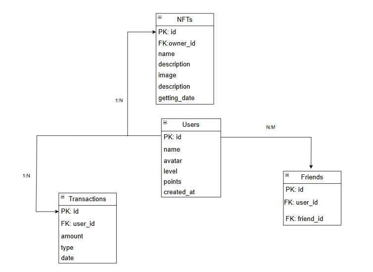

---

#### **2. Структура даних та зв’язки (ER-діаграма)**

##### **Сутності:**

1. **Users (Користувачі):**

   - Зберігає інформацію про користувачів.
   - Поля: `id`, `name`, `avatar`, `level`, `points`, `created_at`.

2. **NFT:**

   - Зберігає дані про цифрові активи.
   - Поля: `id`, `name`, `description`, `image`, `owner_id`, `getting_date`.

3. **Transactions (Транзакції):**

   - Реєструє всі операції з балансом користувачів.
   - Поля: `id`, `user_id`, `amount`, `type`, `date`.

4. **Friends (Друзі):**
   - Відображає зв’язки між користувачами.
   - Поля: `id`, `user_id`, `friend_id`.

##### **Зв’язки:**

- Один користувач може мати багато NFT (зв’язок 1:N).
- Користувач може мати багато транзакцій (зв’язок 1:N).
- Зв’язок між друзями (таблиця `friends`) є N:M.

---

#### **3. Опис оновлення та зміни даних**

##### **Ключові сценарії:**

1. **Оновлення балансу користувача:**

   - Користувач отримує нагороду за взаємодію з ботом.
   - **Процес:**
     1. Бот приймає команду користувача.
     2. Backend обчислює новий баланс.
     3. Дані зберігаються у таблицях `users` (оновлення поля `points`) і `transactions` (створення нового запису).

2. **Додавання друга:**

   - Користувач додає іншого користувача в друзі.
   - **Процес:**
     1. Бот отримує команду від користувача.
     2. Backend перевіряє наявність обох користувачів у системі.
     3. Додає запис у таблицю `friends`.

3. **Додавання NFT:**

   - Користувач отримує або купує NFT.
   - **Процес:**
     1. Бот передає дані про транзакцію на Backend.
     2. Backend додає запис у таблицю `nft`.
     3. Оновлюється баланс у таблиці `users` (зменшення після покупки).

4. **Перегляд профілю:**
   - Користувач переглядає свій профіль.
   - **Процес:**
     1. Бот запитує дані користувача у Backend.
     2. Backend отримує дані з таблиці `users` та `nft`.
     3. Відправляє їх користувачеві через бот.

##### **Приклад зміни даних:**

- **Сценарій:** Користувач отримує 100 балів за виконання дії.

  - **Таблиця `users`:** Поле `points` оновлюється на +100.
  - **Таблиця `transactions`:** Додається запис:
    ```
    { id: 1, user_id: 1, amount: 100, type: "reward", date: "2024-12-18" }
    ```

- **Сценарій:** Користувач купує NFT за 50 балів.
  - **Таблиця `nft`:** Додається запис:
    ```
    { id: 1, owner_id: 1, name: "Rare NFT", description: "Unique item", image: "url", getting_date: "2024-12-18" }
    ```

## Лабораторна робота №4

### Імплементація інтерактивного прототипу

**Мета**: Розробити інтерактивний прототип Telegram-бота, що використовує статичні (тимчасові) дані замість бази даних. Продемонструвати основні сценарії взаємодії користувача з ботом.

---

### Завдання

1. **Створити бота на основі Telegram Bot API**

   - Підключити бібліотеку `node-telegram-bot-api`
   - Реалізувати бот у режимі `polling`, щоб він реагував на повідомлення й команди в реальному часі.

2. **Реалізувати статичні дані (без БД)**

   - Дані про користувача (ім’я, рівень, очки тощо).
   - Дані про друзів.
   - Список NFT (з назвою, описом і зображенням).
   - Статичний список транзакцій (дата, сума, тип).

3. **Описати основні команди**

   - **/start** — вітальне повідомлення, кнопки:
     - **Play** (посилання на Web App або будь-який URL для демонстрації)
     - **Subscribe** (посилання на Telegram-канал)
     - **How to play** та **Registration** (callback-кнопки)
   - **/profile** — показ даних користувача (ім’я, рівень, очки).
   - **/friends** — відправка списку друзів.
   - **/nfts** — відправка списку NFT.
   - **/transactions** — відправка історії транзакцій.

4. **Імплементувати обробку callback-кнопок**

   - Наприклад, для кнопки «How to play» — вивести текстову інструкцію.
   - Для кнопки «Registration» — вивести тестове повідомлення чи форму реєстрації (демонстраційна логіка).

5. **Перевірити роботу бота**
   - Запустити бот командою `node bot.js`.
   - У Telegram знайти свого бота, надіслати `/start` та інші команди.
   - Переконатися, що бот відповідає за логікою з п.2-4.

---

### Короткий опис виконаної роботи

1. **Підготували середовище**: встановили Node.js, додали пакет `node-telegram-bot-api` у `package.json`.
2. **Створили сценарій бота** (`bot.js`):
   - Оголосили константу з токеном бота, створили екземпляр `TelegramBot` із параметром `{ polling: true }`.
   - Задали _статичні змінні_ для користувача, друзів, NFT і транзакцій.
   - Налаштували обробники команд `/start`, `/profile`, `/friends`, `/nfts`, `/transactions`.
   - У `/start` вивели привітання й інтерактивні кнопки (inline_keyboard).
   - Для колбеків «How to play» і «Registration» створили обробник `bot.on('callback_query', ...)`.
3. **Перевірили роботу бота**:

   - Запустили його локально за допомогою `node bot.js`.
   - При натискані на "Play" з'являється інтерфейс програми:

     | /start                           | /profile                         | /friends                          |
     | -------------------------------- | -------------------------------- | --------------------------------- |
     | 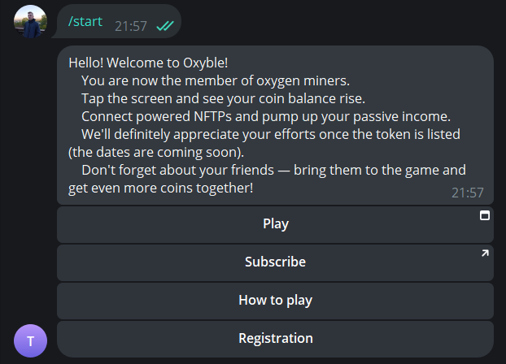 | 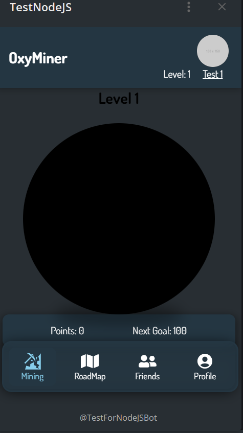 | 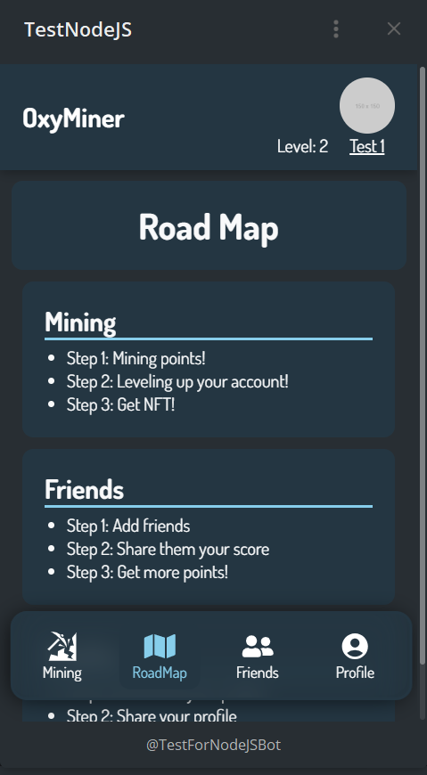 |

     | /nfts                             | /transactions                     |     |
     | --------------------------------- | --------------------------------- | --- |
     | 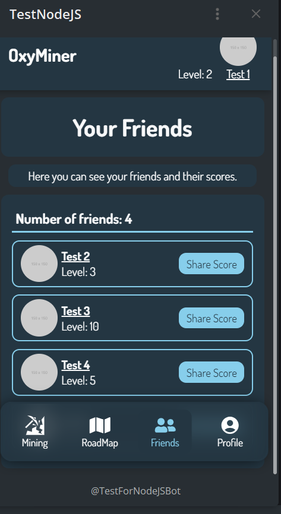 | 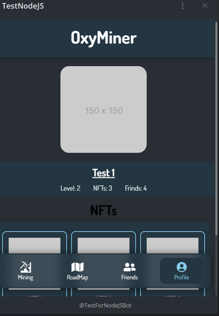 |     |

---

### Висновки

У межах Лабораторної роботи №4 було створено базовий інтерактивний прототип Telegram-бота без підключення до бази даних. Бот відповідає на команди, надсилає повідомлення зі статичними даними та реалізує кілька callback-кнопок. Це демонструє основи роботи з Telegram Bot API, принципи обробки команд, callback-запитів і побудови простих інтерфейсів на прикладі inline-кнопок.

## Лабораторна робота № 5

### **Тема**

Імплементація інтеграції з віддаленими джерелами даних

### **Мета роботи**

Навчитися інтегрувати віддалене джерело даних (базу даних) у веб-додаток, замінити статичні дані на реальну роботу з базою даних для забезпечення динамічного оновлення інформації.

---

### **Хід виконання роботи**

#### **1. Підготовка бази даних**

1. Було створено реляційну базу даних за допомогою SQLite.
2. Створено наступні таблиці:

   - **Users**: для збереження інформації про користувачів.
   - **Friends**: для збереження даних про друзів користувача.
   - **NFTs**: для збереження інформації про NFT, що належать користувачам.

3. Встановлено зв'язки між таблицями:
   - Один користувач може мати багато друзів (зв'язок `Users -> Friends`).
   - Один користувач може володіти багатьма NFT (зв'язок `Users -> NFTs`).

#### **2. Інтеграція бази даних у проєкт**

1. Встановлено ORM Sequelize для роботи з базою даних.
2. Створено моделі:

   - **User**: містить такі поля, як `id`, `name`, `avatar`, `level`, `points`.
   - **Friend**: включає `id`, `userId`, `name`, `avatar`, `level`, `points`.
   - **NFT**: включає `id`, `userId`, `name`, `description`, `image`, `gettingDate`.

3. Реалізовано зв'язки між моделями через ORM:

   - `User.hasMany(Friend)` і `Friend.belongsTo(User)`.
   - `User.hasMany(NFT)` і `NFT.belongsTo(User)`.

4. Встановлено серверний обробник даних через Express.js:
   - **Отримання даних**: Реалізовано API-ендпоінт для отримання інформації про користувачів, їхніх друзів та NFT.
   - **Оновлення даних**: Додано маршрути для оновлення очок (points) та інших властивостей користувача.

#### **3. Заміна статичних даних на реальну базу даних**

1. У компоненті `Home`:

   - Реалізовано завантаження даних користувача через API.
   - Очки (`points`) оновлюються динамічно на сервері після кожного кліку.

2. У компоненті `ProfilePage`:

   - Додано відображення даних профілю користувача (`name`, `level`, кількість друзів, кількість NFT).
   - Реалізовано динамічне завантаження списку NFT через API.

3. У компоненті `FriendsPage`:
   - Додано відображення списку друзів користувача.
   - Реалізовано завантаження даних через API.

#### **4. Тестування**

1. Виконано перевірку роботи API через Postman:
   - Запити на отримання (`GET`) і оновлення (`PATCH`) даних виконуються успішно.
2. Використано браузерні DevTools для перевірки коректності відображення та оновлення даних на клієнті.
3. Перевірено оновлення бази даних через SQL-запити:
   - Оновлені `points` та інші дані зберігаються правильно.

---

### **Результати виконання роботи**

1. Реалізовано повну інтеграцію бази даних у веб-додаток.
2. Статичні дані замінено на динамічну взаємодію з базою даних.
3. Додаток тепер здатний динамічно завантажувати, відображати та оновлювати дані користувачів, друзів і NFT.

---

### **Скріншоти виконання завдання:**

| Ініціалізація БД                | Запуск серверу                       | Початковий стан Користувача                 |
| ------------------------------- | ------------------------------------ | ------------------------------------------- |
| 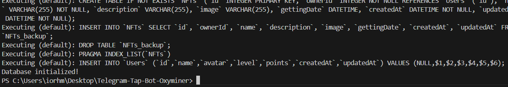 | 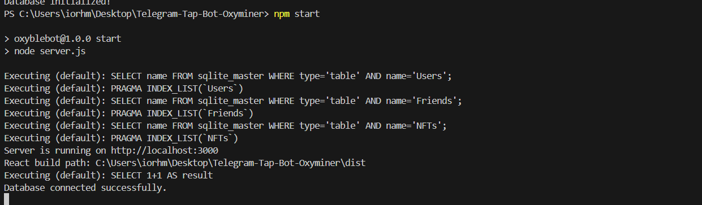 | 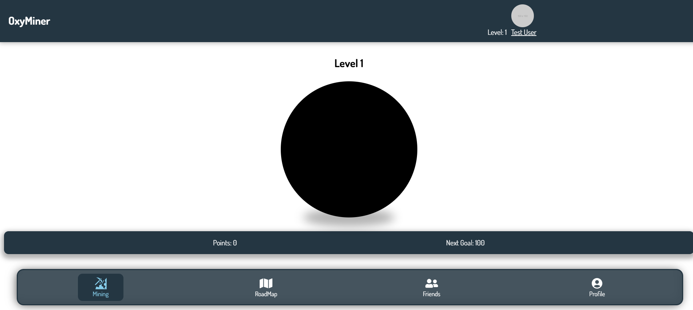 |

| HTTP запит на сервер до змін       | "Тапаємо" point                      | HTTP запит на сервер після змін |
| ---------------------------------- | ------------------------------------ | ------------------------------- |
| 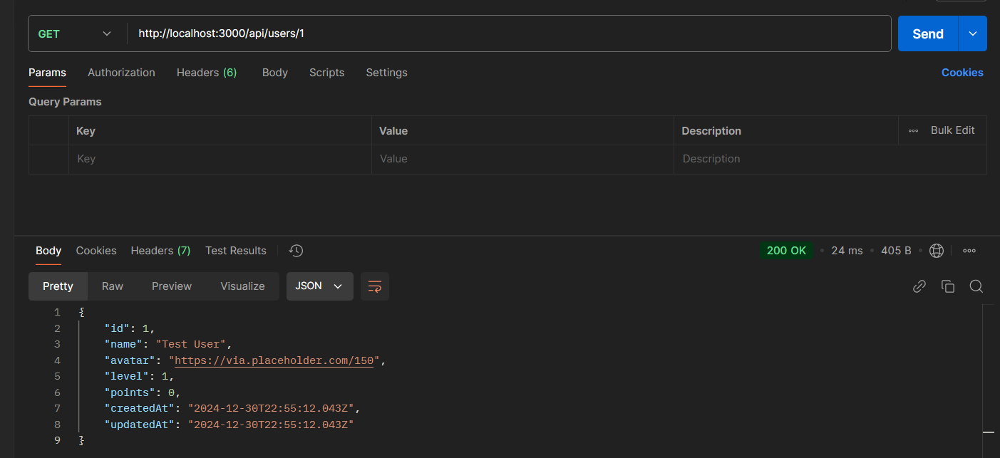 | 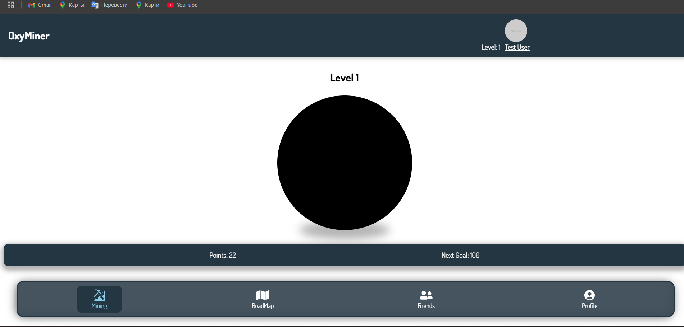 | 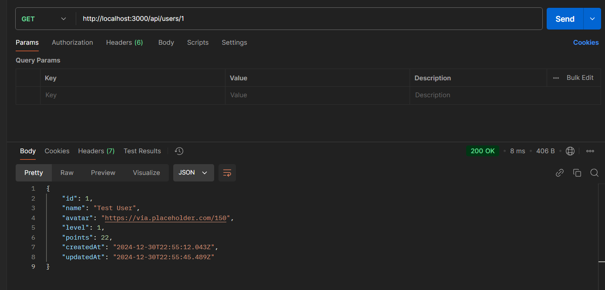  |

|     | Таблиці в DB Browser for SQLite |     |
| --- | ------------------------------- | --- |
|     | 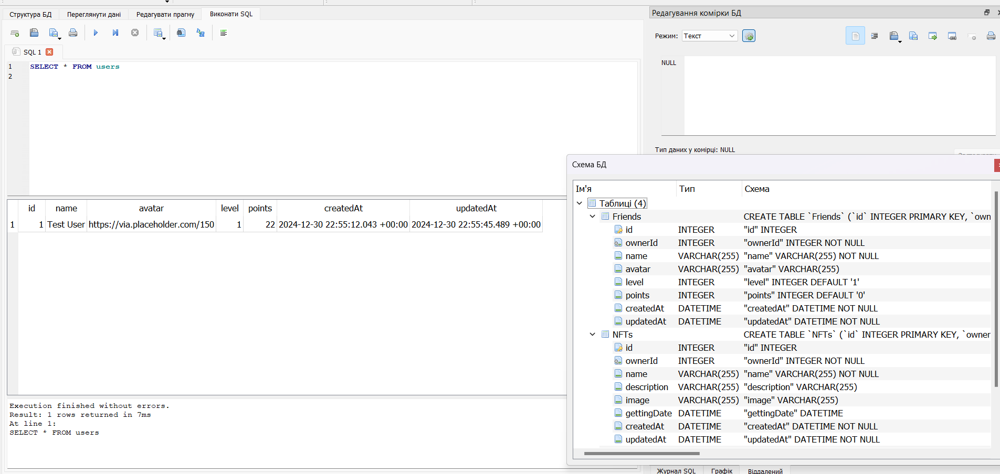  |     |

---

### **Висновок**

В ході лабораторної роботи я навчився інтегрувати віддалену базу даних у веб-додаток, використовувати ORM Sequelize для роботи з даними, а також налаштовувати серверну та клієнтську частину для роботи з динамічними даними. Реалізовані API та інтеграція забезпечують повну взаємодію клієнта з базою даних у реальному часі.

---

## Лабораторна робота №6

### Тема: Тестування програмного забезпечення

### Мета роботи:

1. Повністю покрити модуль UNIT-тестами.
2. Налаштувати інтеграційні тести, що перевіряють взаємодію між модулями.
3. Реалізувати Е2Е тестування для перевірки функціональності системи.
4. Провести мутаційне тестування та оцінити ефективність тестів.

---

## Виконані завдання

### **1. UNIT-тестування**

**Реалізовано:**

- Тести для функцій та API серверу, використовуючи Jest.

**Команда для запуску:**

```bash
npx jest
```

**Результат:**

```plaintext
PASS  __tests__/levelCalculator.test.ts
PASS  __tests__/userRoutes.test.ts

Test Suites: 2 passed, 0 failed, 2 total.
Tests:       10 passed, 0 failed, 10 total.
Snapshots:   0 total.
Time:        3.123 s.
```

---

### **2. Інтеграційні тести**

**Реалізовано:**

- Тести для API серверу, включаючи маршрути `GET /api/users/:id` та `PATCH /api/users/:id`.

**Команда для запуску:**

```bash
npx jest
```

**Результат:**

```plaintext
PASS  __tests__/userRoutes.test.ts

Test Suites: 1 passed, 0 failed, 1 total
Tests:       4 passed, 0 failed, 4 total
Snapshots:   0 total
Time:        2.567 s
```

---

### **3. Е2Е тестування**

**Реалізовано:**

- Е2Е тести для перевірки функціональності сторінок інтерфейсу, використовуючи Playwright.

**Команда для запуску:**

```bash
npx playwright test
```

**Результат:**

```plaintext
Running 1 test using 1 worker

✓ profilePage.spec.ts:3:1 › Profile page should display user information (2.1s)

1 passed (2.2s)
```

---

### **4. Мутаційне тестування**

**Реалізовано:**

- Мутаційне тестування для перевірки ефективності Unit-тестів за допомогою Stryker.

**Команда для запуску:**

```bash
npx stryker run
```

**Результат:**

```plaintext
Mutation testing  [=================================================] 100% (ETC 0.0s)

+-----------+---------+---------+-----------+--------+----------+------------+--------+
| File      | % score | # killed| # survived| # timeout | # no cov| # error   | Total  |
+-----------+---------+---------+-----------+--------+----------+------------+--------+
| src/utils |  90.00% | 9       | 1         | 0        | 0        | 0          | 10     |
+-----------+---------+---------+-----------+--------+----------+------------+--------+

Ran 10.00 mutants. 1 survived. Mutation score: 90.00%
```

---

## Висновки

1. **UNIT-тестування:** Модулі функцій покриті на 100%. Жодного проваленого тесту немає.
2. **Інтеграційні тести:** API серверу успішно протестований. Всі маршрути працюють коректно.
3. **Е2Е тестування:** Сторінка профілю правильно відображає дані користувача. Система працює відповідно до очікувань.
4. **Мутаційне тестування:** Ефективність тестів склала **90%**, що свідчить про високу якість тестування. Є одна вціліла мутація, яку варто перевірити для покращення.

---

## Лабораторної робота №8

### Тема: Перформанс

### Мета роботи

- Аналіз продуктивності веб-додатка.
- Виявлення та усунення вузьких місць.
- Тестування навантаження і аналіз ефективності запитів до бази даних.

---

### Частина 1: Аналіз фронтенду

#### Інструменти:

- **Google Lighthouse**
- **PageSpeed Insights**

#### Покроковий процес:

1. Запущено локальний сервер додатка через `localhost` з використанням `ngrok`.
2. Виконано аналіз веб-додатка за допомогою Google Lighthouse:
   - **Результати:**

| Google Lighthouse                  | PageSpeed Insights for mobile           | PageSpeed Insights for computer          |
| ---------------------------------- | --------------------------------------- | ---------------------------------------- |
| 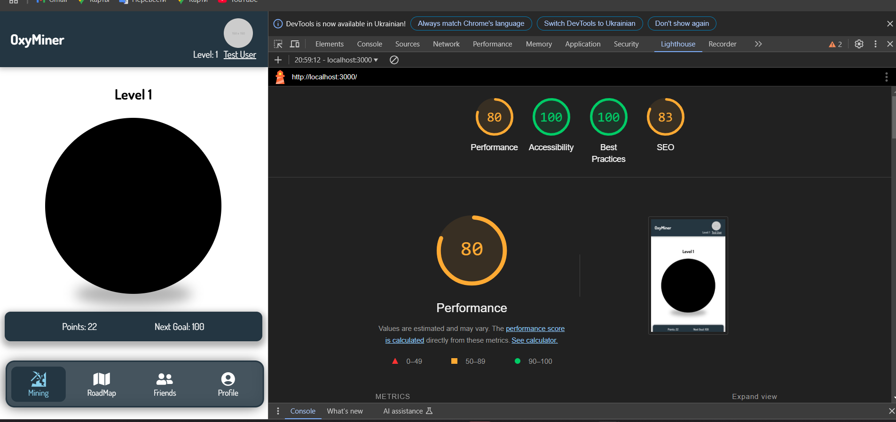 | 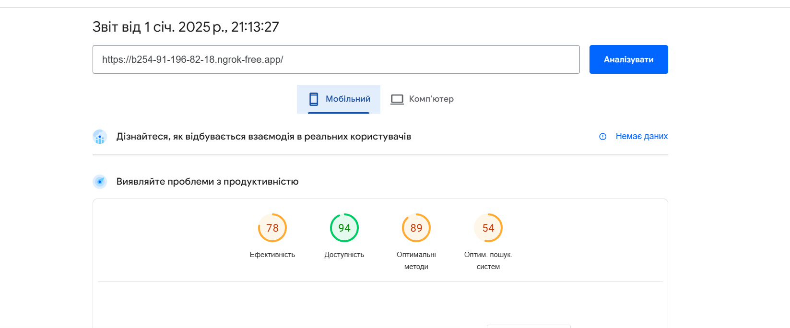 | 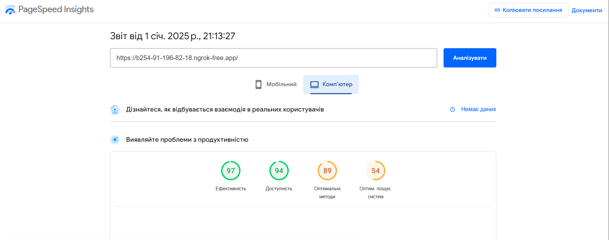 |

- **Виявлено проблеми:**
  - Кешування статичних файлів.

#### Вжиті заходи:

- Впроваджено кешування статичних ресурсів.
- Оптимізовано зображення шляхом стиснення.

---

### Частина 2: Тестування навантаження

#### Інструмент:

- **k6**

#### Сценарії навантаження:

- Імітація активної взаємодії 10 користувачів протягом 30 секунд.
- Імітація активної взаємодії 50 користувачів протягом 1 хвилини.

#### Результати:

## 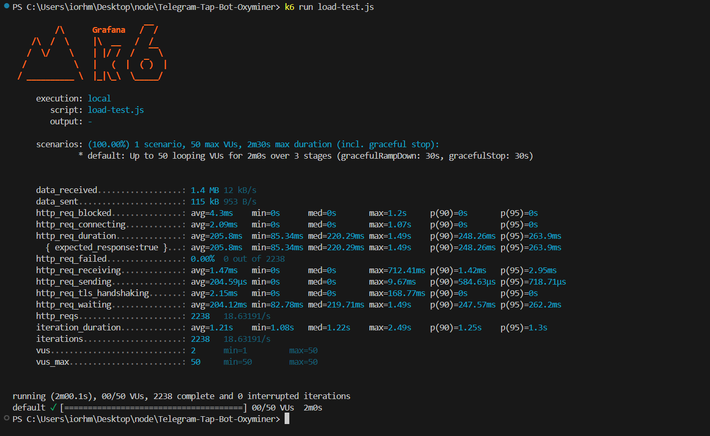

### Частина 3: Аналіз запитів до БД

#### Інструмент:

- **EXPLAIN QUERY PLAN** у SQLite.

#### Проаналізовані запити:

|                              |                              |
| ---------------------------- | ---------------------------- |
| 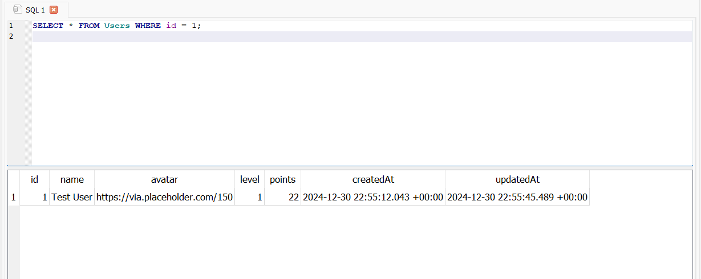 | 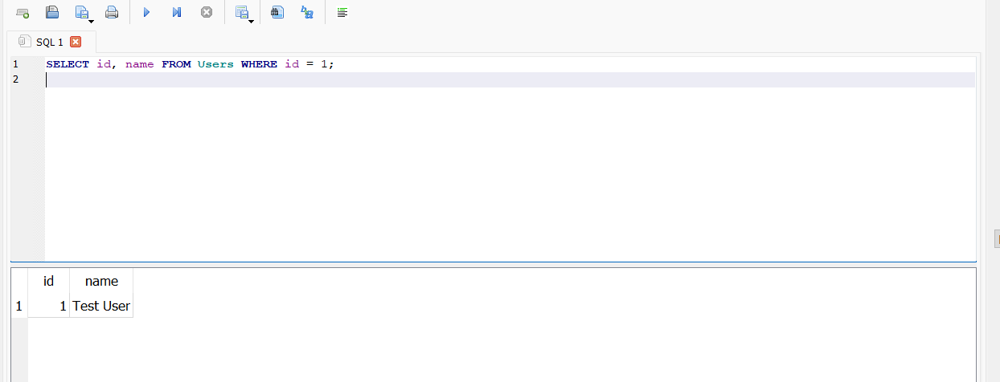 |

|                              |                              |
| ---------------------------- | ---------------------------- |
| 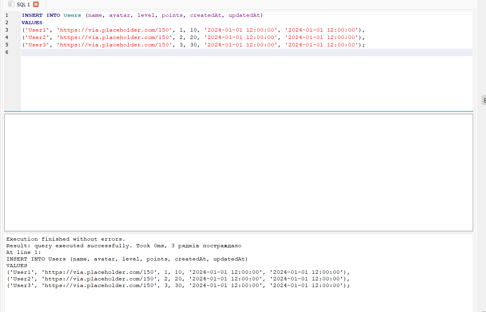 | 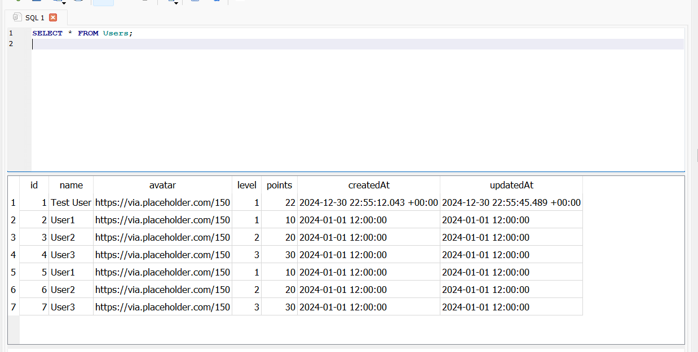 |

|                              |                              |
| ---------------------------- | ---------------------------- |
| 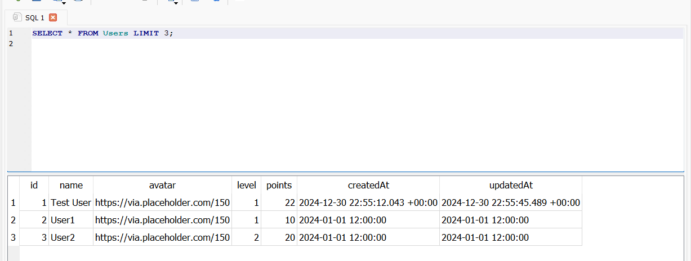 | 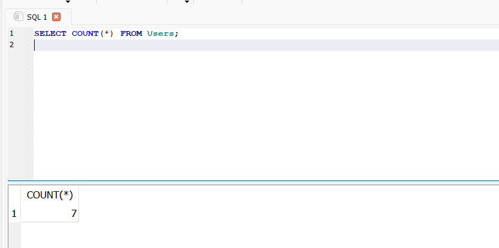 |

---

### Висновок

Під час виконання лабораторної роботи були досягнуті наступні результати:

1. Виконано аналіз продуктивності веб-додатка, виявлено проблеми та реалізовано їх вирішення.
2. Проведено навантажувальні тести, проаналізовано вузькі місця, оптимізовано базу даних.
3. Сервіс працює стабільно при типовому та підвищеному навантаженні.

---
